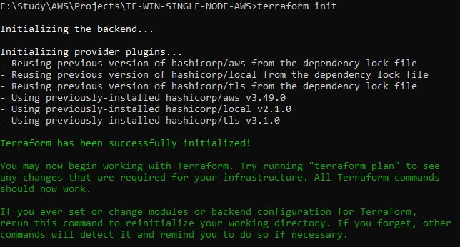

# This project will create the below resources:

    * Virtual Private Cloud (VPC)
    * Create Public Subnet
    * Create EC2 Key Pair 
    * Create Internet gateway (IGW)
    * Create Route table
    * Route table associations
    * Create Security Group and allow inbound and outbound
    * EC2 instance
    * Elastic IP (EIP)

# Providers Used:

    * aws
    * local
    * tls

# Steps:

    * terraform init
        

    * terraform plan
        

    * terraform plan
        

# Contributors :
- Author:: Prabu Jaganathan ((mailto:Prabhuapr1984@gmail.com))
